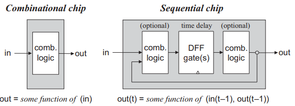
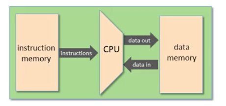
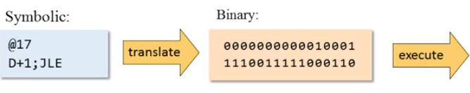
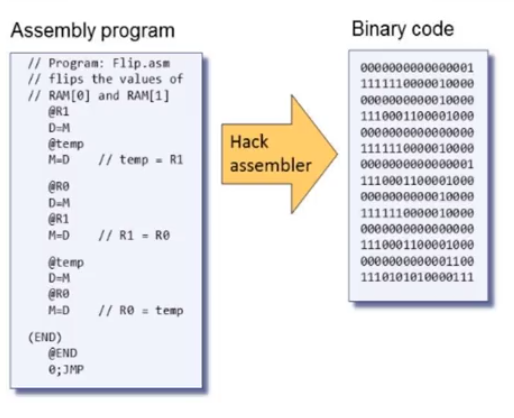
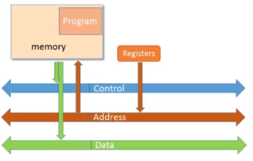
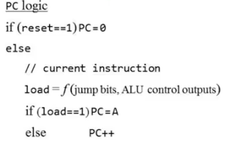
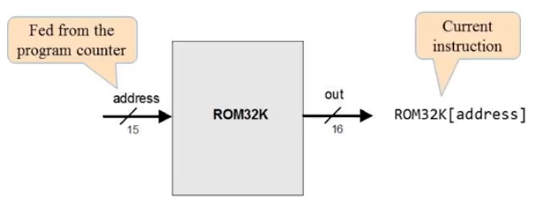

# The Elements of Computing Systems

[TOC]

Note: 

All hardware chapters in the book have same structure. Each chapter focuses on a well-defined task, designed to construct or integrate a certain family of chips. 

- Background section (**what**)- prerequisite knowledge needed to approached this task is provided
- Specification section (**what**) - the chip's various services that should be delivered, 
- Implementation section (**how**) - proposes guidelines and hints how the chips can eventually be implemented 
- Perspective section - rounds up the chapter with concluding comments about important topics left out from the discussion
- Project section - gives step-by-step instructions for actually building the chips on a personal computer, using the hardware simulator


# Day 1 - Boolean Functions and Gate Logic666

## **Background section**

Boolean algebra

Gate Logic 

Actual Hardware Construction

Hardware Description Language

## **Specification section**

Nand Gate

Basic Logic Gates

- Not
- And
- Or
- Xor
- Multiplexor
- Demultiplexor

Multi-bit Version of Basic Gates

- Multi-bit not
- Multi-bit And 
- Multi-bit Or
- Multi-bit Multiplexor

### Multi-way versions of Basic Gates

Multi-bit arrays (buses) should be handled by a computer hardware well by design:

- individual bits in a bus is referred to using array syntax, e.g. `in[16]`

- A 32-bit computer is required to be able to compute (bit-wise) and `And` function on two 32-bit **buses**.
  - to implement this: we need to build an array of 32 binary `And` gates, each operating separately on a pair of bits
  - Abstraction: create a logic gate in a single chip interface consists of two 32-bit input buses and output a 32-bit bus.

> Note: the architecture of n-bit logic gates is basically the same irrespective of n's value.

Different types: 

- Multi-way Or
- Multi-way/multi-bit Multiplexor
- Multi-way/multi-bit demultiplexor

Bit Numbering and Bus syntax:**

- hardware bits are numbered from right to left, starting with 0
  - e.g. `sel=110` that means `sel[2]=1, sel[1]=1, sel[0]=0` 

**Sub-busing**: 

- can only be used on buses that are named in the `IN` and `OUT` statements of an HDL file
  - input or outputs of the chip-pars used in the `PARTS` section
- If you need a sub-bus of internal bus, *you must create the narrower bus as an output*:

## **Implementation and Project section**

Important website: 

- [Hardware Construction Survival Kit](http://nand2tetris-questions-and-answers-forum.32033.n3.nabble.com/Hardware-Construction-Survival-Kit-td3385741.html)
- [From Nand to Tetris](https://www.nand2tetris.org/software) webpage

**Project 1:**

Given: `Nand`

Goal: Build the following gates, 


Implementation:

## A. Elementary logic gates

### Not gate

```
/**
 * Not gate:
 * out = not in
 */

CHIP Not {
    IN in;
    OUT out;

    PARTS:
    Nand(a=in,b=in,out=out);
}
```

### And gate 

```
/**
 * And gate: 
 * out = 1 if (a == 1 and b == 1)
 *       0 otherwise
 */

CHIP And {
    IN a, b;
    OUT out;

    PARTS:
    Nand(a=a,b=b,out=out1);
    Not(in=out1,out=out);
}
```

### Or gate

```
 /**
 * Or gate:
 * out = 1 if (a == 1 or b == 1)
 *       0 otherwise
 */

CHIP Or {
    IN a, b;
    OUT out;

    PARTS:
    Not(in=a,out=nota);
    Not(in=b,out=notb);
    And(a=nota,b=notb,out=out1);
    Not(in=out1,out=out);
}
```

### Exclusive-or gate

```
/**
 * Exclusive-or gate:
 * out = not (a == b)
 */

CHIP Xor {
    IN a, b;
    OUT out;

    PARTS:
    Not(in=a, out=nota);
    Not(in=b, out=notb);
    And(a=a, b=notb, out=w1);
    And(a=nota, b=b, out=w2);
    Or(a=w1, b=w2, out=out);
}
```

### Multiplexor

This is a brute force solution: 

```
/** 
 * Multiplexor:
 * out = a if sel == 0
 *       b otherwise
 */

CHIP Mux {
    IN a, b, sel;
    OUT out;

    PARTS:
    Or(a=b,b=sel,out=out1);
    Not(in=out1,out=out2);
    And(a=a,b=out2,out=w1); 

    Not(in=sel,out=out3);
    And(a=b,b=out3,out=out4);
    And(a=a,b=out4,out=w2); 

    And(a=b,b=sel,out=out5);
    Not(in=a,out=out6);
    And(a=out6,b=out5,out=w3);

    And(a=a,b=b,out=out7);
    And(a=out7,b=sel,out=w4);

    Or(a=w1,b=w2,out=final);
    Or(a=w3,b=w4,out=final1);
    Or(a=final,b=final1,out=out);
}
```

### Demultiplexors

A **demultiplexors** performs the opposite function of a multiplexor: it takes a single input and channels it to one of the two possible outputs according to a selector bit that specifies which output to chose: 

```
/**
 * Demultiplexor:
 * {a, b} = {in, 0} if sel == 0
 *          {0, in} if sel == 1
 */

CHIP DMux {
    IN in, sel;
    OUT a, b;

    PARTS:
    Not(in=sel,out=out1); 
    And(a=in,b=out1,out=a);
    And(a=in,b=sel,out=b);
}
```

## Multi-bit Versions of Basic Gates


```
CHIP Foo {
    IN in[16];
    OUT out;
PARTS:
    // Something16 (in=in, out=notIn);	  ! wrong way to do it 
    // Or8Way (in=notIn[4..11], out=out); ! wrong way to do it
    Something16 (in=in, out[4..11]=notIn);
    Or8Way (in=notIn, out=out);
}
```


## B. 16-bit Variants

### Not16 (16-bit Nor gate)

A 16-bit `Not` gate applies the Boolean operation `Not` to every one of the bits in its `16-bit` input bus

```
/**
 * 16-bit Not:
 * for i=0..15: out[i] = not in[i]
 */

CHIP Not16 {
    IN in[16];
    OUT out[16];

    PARTS:
    Not(in=in[0],out=out[0]);
    Not(in=in[1],out=out[1]);
    Not(in=in[2],out=out[2]);
    Not(in=in[3],out=out[3]);
    Not(in=in[4],out=out[4]);
    Not(in=in[5],out=out[5]);
    Not(in=in[6],out=out[6]);
    Not(in=in[7],out=out[7]);
    Not(in=in[8],out=out[8]);
    Not(in=in[9],out=out[9]);
    Not(in=in[10],out=out[10]);
    Not(in=in[11],out=out[11]);
    Not(in=in[12],out=out[12]);
    Not(in=in[13],out=out[13]);
    Not(in=in[14],out=out[14]);
    Not(in=in[15],out=out[15]);
}
```


### And16 (16-bit And gate)

```
/**
 * 16-bit bitwise And:
 * for i = 0..15: out[i] = (a[i] and b[i])
 */

CHIP And16 {
    IN a[16], b[16];
    OUT out[16];

    PARTS:
    And(a=a[0],b=b[0],out=out[0]);
    And(a=a[1],b=b[1],out=out[1]);
    And(a=a[2],b=b[2],out=out[2]);
    And(a=a[3],b=b[3],out=out[3]);
    And(a=a[4],b=b[4],out=out[4]);
    And(a=a[5],b=b[5],out=out[5]);
    And(a=a[6],b=b[6],out=out[6]);
    And(a=a[7],b=b[7],out=out[7]);
    And(a=a[8],b=b[8],out=out[8]);
    And(a=a[9],b=b[9],out=out[9]);
    And(a=a[10],b=b[10],out=out[10]);
    And(a=a[11],b=b[11],out=out[11]);
    And(a=a[12],b=b[12],out=out[12]);
    And(a=a[13],b=b[13],out=out[13]);
    And(a=a[14],b=b[14],out=out[14]);
    And(a=a[15],b=b[15],out=out[15]);
}
```


### Or16  (16-bit Or gate)

```
/**
 * 16-bit bitwise Or:
 * for i = 0..15 out[i] = (a[i] or b[i])
 */

CHIP Or16 {
    IN a[16], b[16];
    OUT out[16];

    PARTS:
    Or(a=a[0],b=b[0],out=out[0]);
    Or(a=a[1],b=b[1],out=out[1]);
    Or(a=a[2],b=b[2],out=out[2]);
    Or(a=a[3],b=b[3],out=out[3]);
    Or(a=a[4],b=b[4],out=out[4]);
    Or(a=a[5],b=b[5],out=out[5]);
    Or(a=a[6],b=b[6],out=out[6]);
    Or(a=a[7],b=b[7],out=out[7]);
    Or(a=a[8],b=b[8],out=out[8]);
    Or(a=a[9],b=b[9],out=out[9]);
    Or(a=a[10],b=b[10],out=out[10]);
    Or(a=a[11],b=b[11],out=out[11]);
    Or(a=a[12],b=b[12],out=out[12]);
    Or(a=a[13],b=b[13],out=out[13]);
    Or(a=a[14],b=b[14],out=out[14]);
    Or(a=a[15],b=b[15],out=out[15]);
}
```

### Mux16 (16-bit multiplexor)

```
/**
 * 16-bit multiplexor: 
 * for i = 0..15 out[i] = a[i] if sel == 0 
 *                        b[i] if sel == 1
 */

CHIP Mux16 {
    IN a[16], b[16], sel;
    OUT out[16];

    PARTS:
    Mux(a=a[0],b=b[0],sel=sel,out=out[0]);
    Mux(a=a[1],b=b[1],sel=sel,out=out[1]);
    Mux(a=a[2],b=b[2],sel=sel,out=out[2]);
    Mux(a=a[3],b=b[3],sel=sel,out=out[3]);
    Mux(a=a[4],b=b[4],sel=sel,out=out[4]);
    Mux(a=a[5],b=b[5],sel=sel,out=out[5]);
    Mux(a=a[6],b=b[6],sel=sel,out=out[6]);
    Mux(a=a[7],b=b[7],sel=sel,out=out[7]);
    Mux(a=a[8],b=b[8],sel=sel,out=out[8]);
    Mux(a=a[9],b=b[9],sel=sel,out=out[9]);
    Mux(a=a[10],b=b[10],sel=sel,out=out[10]);
    Mux(a=a[11],b=b[11],sel=sel,out=out[11]);
    Mux(a=a[12],b=b[12],sel=sel,out=out[12]);
    Mux(a=a[13],b=b[13],sel=sel,out=out[13]);
    Mux(a=a[14],b=b[14],sel=sel,out=out[14]);
    Mux(a=a[15],b=b[15],sel=sel,out=out[15]);
}
```

## C. Multi-way Variants

2-way logic gates that accept two inputs can be generalized to a multi-way variants that accept arbitrary number of inputs. Here we describe set of multi-way gates that will be used in various chips in our computer architecture. 

### Or8Way

An 8-way `Or` gate that outputs 1 when at least one of its n bits input is 1 and 0 otherwise. 

```
/**
 * 8-way Or: 
 * out = (in[0] or in[1] or ... or in[7])
 */

CHIP Or8Way {
    IN in[8];
    OUT out;

    PARTS:
    // Put your code here:
    Or(a=in[0],b=in[1],out=out1); 
    Or(a=out1,b=in[2],out=out2);
    Or(a=out2,b=in[3],out=out3);
    Or(a=out3,b=in[4],out=out4);
    Or(a=out4,b=in[5],out=out5);
    Or(a=out5,b=in[6],out=out6);
    Or(a=out6,b=in[7],out=out);
}
```

### Mux4Way16

A 4-way 16 bit multiplexor selects one of 4 16-bit input buses and outputs it to a single 16-bit output bus.

- selection is specified by a set of `k` control bits, where `k=log2m`

The computer platform that we develop in this book requires two variations of this chip: a 4-way 16-bit multiplexor and an 8-way 16-bit multiplexor. 


```
Function:
if sel==00 then
	out = c 
else if sel=01
	out = b 
else if sel = 10 then 
	out = c
else if sel=11 then 
	out = d
```

```
/**
 * 4-way 16-bit multiplexor:
 * out = a if sel == 00
 *       b if sel == 01
 *       c if sel == 10
 *       d if sel == 11
 */

CHIP Mux4Way16 {
    IN a[16], b[16], c[16], d[16], sel[2];
    OUT out[16];

    PARTS:
    Mux16(a=a,b=d,sel=sel[0],out=out1);
    Mux16(a=b,b=c,sel=sel[1],out=out2);
    Xor(a=sel[0],b=sel[1],out=w1);
    Mux16(a=out1,b=out2,sel=w1,out=out);
}
```

A better solution: 

```
Mux16(a=a,b=b,sel=sel[0],out=out1);
Mux16(a=c,b=d,sel=sel[0],out=out2);
Mux16(a=out1,b=out2,sel=sel[1],out=out);
```


### Mux8Way16

An 8-way 16 bit multiplexor selects one of 8 16-bit input buses and outputs it to a single 16-bit output bus.

```
Function: 
if sel=000 then 
	out=a
else if sel=001 then 
	out=b 
else if sel=010 then 
	out=c 
...
else if sel=111 then 
	out=h
```

| sel[2] | sel[1] | sel[0] | out  |
| :----: | :----: | :----: | :--: |
|   0    |   0    |   0    |  a   |
|   0    |   0    |   1    |  b   |
|   0    |   1    |   0    |  c   |
|   0    |   1    |   1    |  d   |
|   1    |   0    |   0    |  e   |
|   1    |   0    |   1    |  f   |
|   1    |   1    |   0    |  g   |
|   1    |   1    |   1    |  h   |

```
/**
 * 8-way 16-bit multiplexor:
 * out = a if sel == 000
 *       b if sel == 001
 *       etc.
 *       h if sel == 111
 */

CHIP Mux8Way16 {
    IN a[16], b[16], c[16], d[16],
       e[16], f[16], g[16], h[16],
       sel[3];
    OUT out[16];

    PARTS:
    // Put your code here:
    Mux16(a=a,b=b,sel=sel[0],out=out1);
    Mux16(a=c,b=d,sel=sel[0],out=out2);
    Mux16(a=e,b=f,sel=sel[0],out=out3);
    Mux16(a=g,b=h,sel=sel[0],out=out4);
    Mux4Way16(a=out1,b=out2,c=out3,d=out4,sel=sel[1..2],out=out);
}
```

### DMux4Way

A 4-way 1 bit demultiplexor channels a single bit input into one of 4 possible 1-bit outputs. The selection is specified by a set of `k` control bits (`sel` variable), where `k=log2m` or `m=2^k`, where for `m=4,k=2` 


```
Chip name: DMux4Way
Inputs: in, sel[2]
Outputs: a, b, c, d
Function: If sel=00 then {a=in, b=c=d=0}
    else if sel=01 then {b=in, a=c=d=0}
    else if sel=10 then {c=in, a=b=d=0}
    else if sel=11 then {d=in, a=b=c=0}.
```

Solution:

```
/**
 * 4-way demultiplexor:
 * {a, b, c, d} = {in, 0, 0, 0} if sel == 00
 *                {0, in, 0, 0} if sel == 01
 *                {0, 0, in, 0} if sel == 10
 *                {0, 0, 0, in} if sel == 11
 */

CHIP DMux4Way {
    IN in, sel[2];
    OUT a, b, c, d;

    PARTS:
    DMux(in=in,sel=sel[0],a=in1,b=in2);
    DMux(in=in1,sel=sel[1],a=a,b=c);
    DMux(in=in2,sel=sel[1],a=b,b=d);
}
```

### DMux8Way

A 8-way 1 bit demultiplexor channels a single bit input into one of 8 possible 1-bit outputs. The selection is specified by a set of `k` control bits (`sel` variable), where `k=log2m` or `m=2^k`, where for `m=8,k=3` 

```
Chip name: DMux8Way
Inputs: in, sel[3]
Outputs: a, b, c, d, e, f, g, h
Function: If sel=000 then {a=in, b=c=d=e=f=g=h=0}
    else if sel=001 then {b=in, a=c=d=e=f=g=h=0}
    else if sel=010 ...
    ...
    else if sel=111 then {h=in, a=b=c=d=e=f=g=0}
```

**Solution:**

```
/**
 * 8-way demultiplexor:
 * {a, b, c, d, e, f, g, h} = {in, 0, 0, 0, 0, 0, 0, 0} if sel == 000
 *                            {0, in, 0, 0, 0, 0, 0, 0} if sel == 001
 *                            etc.
 *                            {0, 0, 0, 0, 0, 0, 0, in} if sel == 111
 */

CHIP DMux8Way {
    IN in, sel[3];
    OUT a, b, c, d, e, f, g, h;

    PARTS:
    DMux(in=in,sel=sel[0],a=in1,b=in2);
    DMux4Way(in=in1,sel=sel[1..2],a=a,b=c,c=e,d=g);
    DMux4Way(in=in2,sel=sel[1..2],a=b,b=d,c=f,d=h);
}
```

### **Perspective Section**


# Day 2 - Boolean Arithmetic and the ALU

In this day, we build gate logic designs that represent numbers and perform arithmetic operations on them. 

- starting point is the set of logic gates built in day 1
- Final output:  a full functional **Arithmetic Logic Unit (ALU)**

**ALU** is the centerpiece chip that executes all the arithmetic and logical operations performed by the computer. 

- ALU functionality is an important step toward understanding how the Central Processing Unit (CPU) and the overall computer work 

**Background section:** brief introduction on how binary codes and Boolean arithmetic can be used and to represent and add signed numbers

**Specification section**: describes succession of adder chips, designed to add two bits, three bits, and pairs of n-bit binary numbers

- sets the stage for the ALU specification based on a simple logic design

**Implementation and Project section**: how to build the adder chips and the ALU on a personal computer using the HDL software

## Background section

Most of the operations performed by  digital computers can be reduced to elementary additions of binary numbers. Constructive  understanding of binary addition holds the key to the implementation of numerous computer operations that depend on it, one way or another. 

### Binary numbers

Binary numbers is a base 2 number, e.g. `10011` and this pattern can represent an integer number. Decimal value of this number is computed by convention as follow: 

$(10011)_{two} = 1\cdot2^4+0\cdot2^3+0\cdot2^2+1\cdot2^1+1\cdot2^0 = 19$

In general, let $x = x_nx_{n-1}...x_0$ be a string of digits. The value of $x$ in base $b$, denoted by $(x)_b$ is defined as follows: 
$$
x_nx_{n-1}...x_0 = \sum_{i=0}^{n} x_i \cdot b^i
$$
If you press the keyboard keys labelled `1`,`9` and enter this value on a spreadsheet program, what ends up in some register in the computer's memory is the binary code `10011`. If the computer is a 32-bit machine, what gets stored in the register is the bit patter, `00000000000000000000000000010011  `

### Binary addition

Binary numbers are added  by pairs from right to left. 

- First, we add the two right-most digits, also called the *least significant bits (LSB)* of the two binary numbers. 
- Next, we add the resulting ***carry bit*** (which is either 0 or 1) to the sum of the next pair of bits up the significance ladder. 
- We continue the process until the two most significant bits (MSB) are added. If the last bit-wise addition generates a carry of 1, we can report overflow, otherwise addition completes successfully


> The transfer of the resulting carry bit forward to the addition of the next significant pair of bits can be easily accomplished by proper wiring of the 3-bit adder gates


### Signed binary numbers

A n digit binary system can generate $2^n$ different bit patterns. One can divide this into two equal subsets, in which one is use to represent positive numbers, while the others for negative numbers. One important thing to remember should be that this coding scheme should not complicate the hardware implementation as much as possible. 

The method used today by most computers is called the 2's *complement method*, also known as **radix complement** defined as follows
$$
\bar x =\begin{cases} 2^n - x & x\neq 0 \\
0 & otherwise
\end{cases}
$$
Example: 

- 5-bit binary system, `n=5`, the 2's complement representation of `-2` is $2^5-(00010)_{2} = (32)_{10}-(20)_{10} = (30)_{10} = (11110)_{2}$

Remarks: 

- When the 2's complement method is applied to n-bit systems, $x+(-x)$ always sums up to $2^n$ - a property that gives the method its name
  - `x=(00010), -x = (11110)`
- n-bit system can code a total of $2^n$ signed numbers,
  - max number : $2^{n-1}-1$
  - min number: $-2^{n-1}$
- the code of all positive numbers begin with a 0
- the code of all negative numbers begin with a 1


- Shortcut to obtain the code of $-x$ from the code of $x$: flip all the bits of $x$ and add 1 to the result
  - example: 0001=> 1110+0001 = 11111 

**Idea:** Since $2^n - 1 = 11111111$ for an 8-bit binary system, its easy to subtract $x$ from such a number. One just have to flip the bits and then add 1 or $00000001$. 
$$
2^n - x = 1 + (2^n - 1) - x
$$
Example: computing

input: 4 => 0100

output: -4 

```
1111 - 0100 = 1011
1011 + 0001 = 1100
```

> A particularly attractive feature of this representation is that addition of any two signed numbers in 2's complement is exactly the same as addition of positive numbers. 

- example (-1) + (-2) = -3 => 1111+1110 = 1101

**What about subtraction?** 

- x - y  = x + (-y)
  - flip all bits of  y and add 1. 


## Specification section 

### Adders

- half-adder: designed to add two bits 
- full-adder: designed to add three bits
- adder: designed to add two n-bit numbers

incrementer: a special-purpose chip dedicated to adding the constant 1 to a given number

### The Arithmetic Logic Unit (ALU)

**Von Neumann Architecture**


The ALU computes a function on the two inputs, and outputs the results

  


$f$: one out of a family of pre-defined arithmetic and logical functions

- Arithmetic operations: integer addition, multiplication, division, ...
- logical operations: And, Or, Xor, ..

**HACK ALU**: 


- operates on two 16-bit, two's complement values
- outputs a 16-bit two's complement values
- which function to compute is set by six 1-bit inputs 
  - zx,nx, zy, ny,f, no
    - zx,nx,zy,ny are pre-setting manipulations
    - f is a selection of the binary addition/subtraction operation
    - no - negation of the output if no=0
  - this things happen one after the other
    - if zx=0, then x=000, and nx=0 then x=111


- computes one out of a family of 18 functions 

- also outputs two 1-bit values 

  - zr, ng

    


To cause the ALU to compute a function, set the control bits to the binary combination listed in the table. 


## Implementation & Project section

Project 2: Combinatorial Chips

Given: All the chips built in Project1

Goal: Build the following chips: a family of combinatorial chips, from simple adders to an Arithmetic Logic Unit


### Half Adder


*Implementation tip*: can be build using two very elementary gates. `sum` and `carry` results looks similar to some gates created on Day 1. 

 ```
/**
 * Computes the sum of two bits.
 */

CHIP HalfAdder {
    IN a, b;    // 1-bit inputs
    OUT sum,    // Right bit of a + b 
        carry;  // Left bit of a + b

    PARTS:
    Xor(a=a,b=b,out=sum);
    And(a=a,b=b,out=carry);
}
 ```

### Full Adder


*Implementation tips*: can be built from two half-adders

```
/**
 * Computes the sum of three bits.
 */

CHIP FullAdder {
    IN a, b, c;  // 1-bit inputs
    OUT sum,     // Right bit of a + b + c
        carry;   // Left bit of a + b + c

    PARTS:
    HalfAdder(a=a,b=c,sum=sum1,carry=carry1);
    HalfAdder(a=sum1,b=b,sum=sum,carry=carry2);
    Or(a=carry1,b=carry2,out=carry);
}
```

### Add16 : 16-bit adder


Implementation tips:

- an n-bit adder can be built from n full-adder chips
- the carry bit is "piped" from the right to left 
- The MSB  (most significant bit) carry bit is ignored

```
/**
 * Adds two 16-bit values.
 * The most significant carry bit is ignored.
 */

CHIP Add16 {
    IN a[16], b[16];
    OUT out[16];

    PARTS:
   HalfAdder(a=a[0],b=b[0],sum=out[0],carry=carry1);
   FullAdder(a=a[1],b=b[1],c=carry1,sum=out[1],carry=carry2);
   FullAdder(a=a[2],b=b[2],c=carry2,sum=out[2],carry=carry3);
   FullAdder(a=a[3],b=b[3],c=carry3,sum=out[3],carry=carry4);
   FullAdder(a=a[4],b=b[4],c=carry4,sum=out[4],carry=carry5);
   FullAdder(a=a[5],b=b[5],c=carry5,sum=out[5],carry=carry6);
   FullAdder(a=a[6],b=b[6],c=carry6,sum=out[6],carry=carry7);
   FullAdder(a=a[7],b=b[7],c=carry7,sum=out[7],carry=carry8);
   FullAdder(a=a[8],b=b[8],c=carry8,sum=out[8],carry=carry9);
   FullAdder(a=a[9],b=b[9],c=carry9,sum=out[9],carry=carry10);
   FullAdder(a=a[10],b=b[10],c=carry10,sum=out[10],carry=carry11);
   FullAdder(a=a[11],b=b[11],c=carry11,sum=out[11],carry=carry12);
   FullAdder(a=a[12],b=b[12],c=carry12,sum=out[12],carry=carry13);
   FullAdder(a=a[13],b=b[13],c=carry13,sum=out[13],carry=carry14);
   FullAdder(a=a[14],b=b[14],c=carry14,sum=out[14],carry=carry15);
   FullAdder(a=a[15],b=b[15],c=carry15,sum=out[15],carry=carry16);
}
```

### Incrementor 

16-bit incrementor


Implementation tip: the single-bit 0 and 1 values are represented in HDL as `false` and `true`

- Note that indexing starts from right to left

```
/**
 * 16-bit incrementer:
 * out = in + 1 (arithmetic addition)
 */

CHIP Inc16 {
    IN in[16];
    OUT out[16];

    PARTS:
    Add16(a=in,b[1..15]=false,b[0]=true,out=out);
}
```

### ALU


Implementation tips: 

- Building blocks: `Add16` and various chips built in Project 1
- Can be built with less than 20 lines of HDL codes

```
// This file is part of www.nand2tetris.org
// and the book "The Elements of Computing Systems"
// by Nisan and Schocken, MIT Press.
// File name: projects/02/ALU.hdl

/**
 * The ALU (Arithmetic Logic Unit).
 * Computes one of the following functions:
 * x+y, x-y, y-x, 0, 1, -1, x, y, -x, -y, !x, !y,
 * x+1, y+1, x-1, y-1, x&y, x|y on two 16-bit inputs, 
 * according to 6 input bits denoted zx,nx,zy,ny,f,no.
 * In addition, the ALU computes two 1-bit outputs:
 * if the ALU output == 0, zr is set to 1; otherwise zr is set to 0;
 * if the ALU output < 0, ng is set to 1; otherwise ng is set to 0.
 */

// Implementation: the ALU logic manipulates the x and y inputs
// and operates on the resulting values, as follows:
// if (zx == 1) set x = 0        // 16-bit constant
// if (nx == 1) set x = !x       // bitwise not
// if (zy == 1) set y = 0        // 16-bit constant
// if (ny == 1) set y = !y       // bitwise not
// if (f == 1)  set out = x + y  // integer 2's complement addition
// if (f == 0)  set out = x & y  // bitwise and
// if (no == 1) set out = !out   // bitwise not
// if (out == 0) set zr = 1
// if (out < 0) set ng = 1

CHIP ALU {
    IN  
        x[16], y[16],  // 16-bit inputs        
        zx, // zero the x input?
        nx, // negate the x input?
        zy, // zero the y input?
        ny, // negate the y input?
        f,  // compute out = x + y (if 1) or x & y (if 0)
        no; // negate the out output?

    OUT 
        out[16], // 16-bit output
        zr, // 1 if (out == 0), 0 otherwise
        ng; // 1 if (out < 0),  0 otherwise

    PARTS:
    Mux16(a=x,b=false,sel=zx,out=out1);
    Not16(in=out1,out=b1);
    Mux16(a=out1,b=b1,sel=nx,out=x1);

    Mux16(a=y,b=false,sel=zy,out=out2);
    Not16(in=out2,out=b2);
    Mux16(a=out2,b=b2,sel=ny,out=y1);

    Add16(a=x1,b=y1,out=outAdd);
    And16(a=x1,b=y1,out=outAnd);
    Mux16(a=outAnd,b=outAdd,sel=f,out=outf);

    Not16(in=outf,out=outN);
    Mux16(a=outf,b=outN,sel=no,out=outx);

    Mux16(a=outf,b=outN,sel=no,out=out);
    Test(in=outx,sel=outr);
    Last(in=outx,out=outg);

    Mux(a=true,b=false,sel=outr,out=zr);
    Mux(a=false,b=true,sel=outg,out=ng);
}
```

I had to create helper chips so that I can manage a particular output I desire. 

```
CHIP Last{
    IN in[16];
    OUT out; 
    PARTS:
    And(a=in[15],b=true,out=out);
}

CHIP Test {
    IN in[16];
    OUT sel;

    PARTS:
    Or8Way(in=in[0..7],out=test1);
    Or8Way(in=in[8..15],out=test2);
    Or(a=test1,b=test2,out=sel);
}
```


### Perspective section

- implementation of the adder is a standard but it was inefficient due to the delay of the propagation of the carry bit from the LSB to MSB.

  - can be alleviated using look-ahead techniques

- Low-level improvement of the Addition operation on a computer system has tremendous effect on its performance

- In any given computer, the overall functionality of the hardware/software platform is delivered jointly by the ALU and the operating system that runs on top if it. 

  


 # Day 3 - Memory (Sequential Logic)

Von-Neumann Architecture: 


All chips built in day 1 and 2 were combinatorial. Combinatorial chips computes functions that depend solely on combinations of their input values.  In day 2, we mainly built the ALU unit for our computers. In this day, we want to built memory. 

- these can provide important processing functions but they cannot *maintain state*
  - computers must also store and recall values, they must be equipped with memory elements that can preserve data over time. These  memory elements are built from sequential chips. 

Implementation of memory elements is an intricate art involving synchronization, clocking, and feedback loops. 

- most of this can be embedded in the operating logic of very low-level sequential gates called flip-flops
- it can be used to specify and build all the memory devices 
  - from binary cells to registers to memory banks to counter 

This effort will complete the construction of the chip set needed to build an entire computer. 


## Background section

> The act of "remembering something" is inherently time-dependent: you remember now what has been committed to memory before.  

- in order to build chips that "remember" information, we must first develop some standard means for representing the progression of time.

**The Clocks**

- continuous train of alternating signals is used to represent the passage of time in most computers. 
  - hardware implementation is based on an oscillator that alternates between labeled 0-1,low-high,tick-tock, etc. 
  - the elapsed time between the beginning of a "tick" and the end of the subsequent "tock" is called *cycle*, and each clock cycle is taken to model discrete time unit
  - the *current* clock phase (tick or tock) is represented by a binary signal
- Using the hardware circuity, this signal is simultaneously broadcast to every sequential chip throughout the computer platform.  

**Flip-flops**

- the most elementary sequential element in a computer 

  

- there are several variants of flip-flops

  - our focus: data flip-flop (DFF)
    - its interface consists of a single-bit data input and a single-bit data output
    - it has a clock input that continuously changes according to the master clock's signal
    - output and the clock inputs enable the DFF to implement the time-behaviour `out(t)=in(t-1)`
      - `   out`,`in` are the gate's input and output values and t is the current clock 
      - DFF simply outputs the input values from previous time unit

- this elementary behaviour can form the basis of all the hardware devices that computers use to *maintain state*, from binary cells to registers to arbitrarily large random access memory (RAM) units 

**Registers**

- a storage device that can "store", or "remember", a value over time, implementing the classical storage behaviour `out(t)=in(t-1)`. A

  - a DFF, on the other hand, can only output its previous input

- Register is implemented from a DFF by simply feeding the output of the latter back into its signal

  

- Multiplexor is introduced in the register to resolve the output ambiguity
- the <u>select bit</u> of the multiplexor becomes the <u>load bit</u> of the overall register chip
  - if we want the register to start storing a new value: set *load* bit to 1
  - if we want the register to keep storing its internal value until further notice: set *load* to 0

Once we have developed the basic mechanism for remembering a single bit over time, we can easily construct arbitrarily wide registers. 

- can be achieved by forming an array of as many single-bit registers as needed, creating a register that holds multi-bit values
  - <u>width</u> is register's basic design parameter, e.g. 16, 32, 64
  - multi-bit content of such registers are typically referred to as **words**


Remembering For Ever: 1-bit register

Goal: remember an input bit "forever", until requested to load a new value


Building multi-bit register from the 1-bit register: 


**'Memories**

Once we have the ability to represent words, we can proceed to build memory banks of arbitrary length. 

RAM abstraction: a sequence of *n* addressable registers, with addresses 0 to *n-1*

- Note: at any given point of time, only one register in the RAM is selected 


- this can be done by stacking together many registers to form a *Random Access Memory (RAM)*.
  - *random access memory* derives from the requirement that read/write operations on a RAM should be able to access randomly chosen words, with no restrictions on the order in which they are accessed
  
    - CAN BE ACCESSED AT THE SAME TIME INSTANTENOUSLY! (approximately in human senses)
  
  - RAM device accepts three inputs: a data input, an address input, and a load bit
    - *<u>address</u>* dictates which address to be accessed: 
    
      - ***k*** width of address input: $k = log_2 n$ or $2^n=k$ , e.g. k=8, n=3
      - k is basically the number of register stacked in the RAM
    
    - read operation (load=0), RAM outputs the values of the selected register
    
      To read `Register i`: 
    
      - set address `i`
      - `out` emits the state of `Register i`
    
    - write operation (load=1), the selected memory register commits to the input value in the next time unit, at which point the RAM's output will start emitting it.
    
      To set `Register i` to `v`: 
    
      - set address=i
      - set `i=v` 
      - set`load=1`
      - Result: `Register i` becomes `v` 
- each word in the n-register RAM is assigned a unique address
- aside from the RAM, a logic gate design (<u>direct access logic</u>) is also necessary to access/select an individual register using the address
- Basic design parameters of a RAM device are its data width - width of each one of its words, and its size - the number of words in the RAM.
  
  - modern computers typically employ 32/64-bit wide RAMS whose sizes are up to hundreds of millions. 

**Counters** 

- a sequential chip whose state is an integer number that increments every time unit, effecting the function
  $$
  out(t) = out(t-1)+c
  $$
  where `c` is typically 1. 

- CPU includes a <u>program counter</u> whose output is interpreted as the address of the instruction that should be executed next in the current program

Where counters come to play: 

- keeping track of which instruction to fetch and execute next
- control mechanism can be realized by a program counter (pc)
  - Three possible control things: 
    - reset: fetch the first instruction `pc=0`
    - next: fetch the next instruction `pc++`
    - goto: fetch instruction n `pc=n` 

**Time Matters**:




- all the chips in this day will be sequential which embeds one or more DFF gates, either directly or indirectly
- DFF gates endow sequential chips with the ability to either maintain state (as in memory units) or operate on state (as in counters). 
  - technically speaking, this is done by forming feedback loop inside the sequential chip
  
  - In combinatorial chips, where time is neither modeled nor recognized, the introduction of feedback loops is problematic: the output would depend on the input, which itself would depend on the output, and thus the output would depend on itself. 
  
  - In sequential chip, there is no problem in feeding the output back into itself, since the DFFs introduce an inherent time delay: the output at time t does not depend on itself, but rather on the output at time t-1. This property guards against the uncontrolled "data races" that would occur in combinatorial chips with feedback loops.
  
    
- The output of combinatorial chips change when their inputs change, irrespective of time. In contrast, the inclusion of the DFFs in the sequential architecture ensures that their outputs change only at the point of transition from one clock cycle to the next, and not within the cycle itself. 
  
  - we allow sequential chips to be in unstable states during clock cycles, requiring only that at the beginning of the next cycle they output correct values. 

**Summary:** 


The hierarchy of the different components of RAM:

clocks(signal) => DFF  =>  Register => RAM

Clocks (continuous signal) makes up the DFF, while a series of DFF will give you a register and a stack of this register will give you a random access memory. 

## Specification and Project section 

This section specifies a hierarchy of sequential chips: 

- data-flip-flops 
- register (based on DFFs)
- memory banks (based on registers)
- counter chips (based on registers)


Project 3:

Given: 

- all the chips built in projects 1 and 2 
- data flip-flops (dff gate)

Goal: 

- build the following chips


###  Data Flip-flop


### Registers

**1-bit register:**

Implementation tip: can be built from a `DFF` and a multiplexor


```
/**
 * 1-bit register:
 * If load[t] == 1 then out[t+1] = in[t]
 *                 else out does not change (out[t+1] = out[t])
 */

CHIP Bit {
    IN in, load;
    OUT out;

    PARTS:
    DFF(in=in,out=in1);
    DFF(in=load,out=load1);
    Mux(a=out1,b=in1,sel=load1,out=out3,out=out);
    DFF(in=out3,out=out1);
}

```

**Remarks:** 

- I learn from this exercise that a variable with unknown value is initialized to 0, e.g. `out1` which was used in the `Mux` even before it was used in the final `DFF` chip.

- I started to get the idea of the usefulness of the following multiple output scheme and how to use it for further computations

This one is from the *Hardware Construction Survival Kit*:

```
CHIP Foo {
    IN a, b, c;
    OUT out1, out2;
    PARTS:
       Something (a=a, b=b, out=x, out=out1);
       Whatever (a=x, b=c, out=out2);
    }
```


**16-bit register:** 

Implementation tip: can be built from multiple 1-bit registers


```
/**
 * 16-bit register:
 * If load[t] == 1 then out[t+1] = in[t]
 * else out does not change
 */

CHIP Register {
    IN in[16], load;
    OUT out[16];

    PARTS:
    Bit(in=in[0],load=load,out=out[0]);
    Bit(in=in[1],load=load,out=out[1]);
    Bit(in=in[2],load=load,out=out[2]);
    Bit(in=in[3],load=load,out=out[3]);
    Bit(in=in[4],load=load,out=out[4]);
    Bit(in=in[5],load=load,out=out[5]);
    Bit(in=in[6],load=load,out=out[6]);
    Bit(in=in[7],load=load,out=out[7]);
    Bit(in=in[8],load=load,out=out[8]);
    Bit(in=in[9],load=load,out=out[9]);
    Bit(in=in[10],load=load,out=out[10]);
    Bit(in=in[11],load=load,out=out[11]);
    Bit(in=in[12],load=load,out=out[12]);
    Bit(in=in[13],load=load,out=out[13]);
    Bit(in=in[14],load=load,out=out[14]);
    Bit(in=in[15],load=load,out=out[15]);
}
```

Repetitive task of `Bit` chips

### Memory

> An important aspect of this is that there is no such thing as an "uninitialized variable" in HDL. If a wire is connected to an output somewhere in the HDL, it can be connected to any input. This is particularly important to understand for Chapter 3.

8-register RAM: 

Basic functionality: 

```
// Let M stand for the state of the selected register 
if load then { 
	M = in
	// from the next cycle onward;
	out = M
}
else 
	out = M
```


Implementation tips: 

- feed the `in` value to all the registers, simultaneously
- use `mux/demux` chips to select the right register


RAM8, RAM64,RAM512


Recursive ascent to build the RAM chips:

Implementation tips:  

- a `RAM` device can be built by grouping smaller`RAM`-parts together
- think about the `RAM's address input as consisting of two fields: 
  - one field can be used to select a RAM-part
  - the other field can be used to select a register within that RAM-part
- use mux/demux logic to effect this addressing scheme


### Counter


16-bit Program Counter:


Implementation tip: can be built from a register, an incrementor, and some logic gates

- PC chip is similar to that of a register except that it has two additional control bits labeled `reset` and `inc`.	

  - if `inc=1`: counter increments its state in every clock cycle, emitting the value of 

    `out(t)=out(i-1)+1`

  - To rest the counter to 0, we assert the `reset` bit

  - To initialize to some counting base `d`, we put `d` in the `in` input and assert the `load` bit 

```
if (reset[t] == 1) 
	out[t+1] = 0
else if (load[t] == 1)  
	out[t+1] = in[t]
else if (inc[t] == 1)   
	out[t+1] = out[t] + 1  (integer addition)
else                    
	out[t+1] = out[t]
```


```
/**
 * A 16-bit counter with load and reset control bits.
 * if      (reset[t] == 1) out[t+1] = 0
 * else if (load[t] == 1)  out[t+1] = in[t]
 * else if (inc[t] == 1)   out[t+1] = out[t] + 1  (integer addition)
 * else                    out[t+1] = out[t]
 */

CHIP PC {
    IN in[16],load,inc,reset;
    OUT out[16];

    PARTS:
    // Put your code here:
    Register(in=in,load=load,out=outA);

    Register(in=outz,load=true,out=outy);
    Inc16(in=outy,out=outB);

    Register(in=in,load=load,out=outC);

    Register(in=false,load=load,out=outG);


    DFF(in=reset,out=resetl);
    DFF(in=load,out=loadl);
    DFF(in=inc,out=incl);
    Mux8Way16(a=outA,b=outB,c=outC,d=outC,e=false,f=false,g=outG,h=false,
    		   sel[2]=resetl,sel[1]=loadl,sel[0]=incl,out=outz,out=out);   
}
```

## Perspective section


# Day 4 - Machine Language

Same hardware can run many different software programs


we are going to look at the specification of the computer that we want to build


**Machine language:** 


How do you specify the instruction? 

- instructions are always a sequence of bits

Which instruction to proceed?

- instruction register

What to operate on? (address - memory location)

- instruction address register


**Mnemonics:**

Instructions: a conversion of the command `add r3 to r2` to binary form


**Interpretation 1**: the "symbolic form" doesn't really exist but is just a convenient mnemonic to present machine language instructions to humans. 

**Interpretation 2**: we will allow humans to write machine language instructions using this "assembly language" and will have an "assembler" program convert it to the bit-form

Machine language: 

- specification of the hardware/software interface
  - what are the supported operations
  - what do they operate on? 
  - how is the program controlled
- usually in close correspondence to actual hardware architecture
  - not necessarily so
- cost-performance tradeoff
  - silicon area
  - time to complete instruction

Machine operations: 

- usually corresponds to what's implemented in hardware
  - arithmetic operations
  - logical operations
  - flow control
- differences between machine languages
  - richness of the set of operations (divisions, bulk copy)
  - data types (width, floating point, ...)

Addressing: how to decide what data to work on? 

- what we need to work on resides on a memory

- Accessing a memory location is expensive 

  - need to supply a long address
  - getting the memory contents into the CPU take time 

- Solution: memory hierarchy (solved by von Neumann)

  - every time we get farther from the ALU, our memory becomes bigger, accessing it become harder (longer time to retrieve)

- Registers- the smallest memory that resides on the CPU

  - their number and functions are a central part of the machine language

    Types of Registers: 

    - data registers: `Add R1, R2` 
    - address registers: `Store R1,@A` -- *store R1 to the address specified by A*


Addressing Modes: 


**Input/Output**

- many types of input and output devices
  - keyboard, mouse, camera, sensors, printers, screen, sound, ...
- CPU needs some kind of protocol to talk to each of them 
  - software "drivers" know these protocols
- One general method of interaction uses "memory mapping" 
  - memory location 12345 holds the direction of the last movement of the mouse
  - memory location 45678 is not a real memory location but a way to tell the printer which paper to use

Machine languages: Flow control 

- Which instruction to proceed? or What instruction to execute next?

- Flow control 

  - usually the CPU executes machine instructions in sequence

  - sometimes we need to "jump" unconditionally to another location, e.g. so we can loop

    

- Sometimes we need to jump only if some condition is met 

  

The Hack Computer and Machine Language

- hardware design and software design go hand in hand

**Hack computer: hardware**



A 16-bit machine consisting of: 

>  a machine where everything is consist of 16-bits e.g. data are 16-bits, output is 16-bits

- data memory (RAM): a sequence of 16-bit registers
  - RAM[0],RAM[1], RAM[2], ....
- instruction memory (ROM): a sequence of 16-bit registers
  - ROM[0],ROM[1], ROM[2], ....

- Central Processing Unit: performs 16-bit instructions 
- Instruction bus/data bus/address buses - a highway (16 lanes) of bits 

**Hack computer: software**

Hack machine language: 

- 16-bit A-instructions
- 16-bit C-instructions 

Hack program = sequence of instructions written in the Hack machine language

**Hack computer: control**

Control: 

- the ROM is loaded with a hack program
- the reset button is pushed
- the program starts running 

**Hack computer: registers**


The Hack machines recognizes three registers: 

- D, A holds a 16-bit value
- M represent the 16-bit RAM register addressed by A

**The A-instruction:** 

Syntax: `@value`

- where `value` is either: 
  - a non-negative decimal constant or 
  - a symbol referring to such a constant  (later)

Semantics: 

- sets the `A` register to value
- side effect: RAM[A] becomes the selected RAM register

Example: `@21`

Effect: 

- sets the `A` register to 21 
- `RAM[21]` becomes the selected `RAM` register

**The C-instruction**

`dest=comp; jump` (both `dest` and `jump` are optional)


Semantics:  

- compute the value of comp
- stores the result in dest
- if the boolean expression (`comp jump 0`) is true, jumps to execute the instruction stored in `ROM[A]`

```
// set the D register to -1 
D=-1

// set RAM[300] to the value of the D register minus 1
@300 // A=300
M=D-1 // RAM[300]=D-1

// If (D-1==0) jump to execute the instruction stored in ROM[56]
@56      // A=56
D-1;JEQ  // if (D-1==0) goto 56
```

Two ways to express the same semantics; 

- binary code 
- symbolic language




**The A-instruction: symbolic and binary syntax**


**The C-instruction: symbolic and binary syntax**


**Look-up table:** for `comp`


**Look-up table**: for `dest`


**Look-up table**: for `jump` 


**Hack program:** 


**Input/Output** 

How to use machine language to manipulate this I/O


Peripheral I/O devices: 

- keyboard: used to enter inputs
- screen: used to display outputs

I/O devices are used for: 

- getting data from users
- displaying data to users

High-level approach: (Nand2Tetris Part II)

- sophisticated software libraries enabling text,graphics, animation, audio, video, etc. 

Low-level approach: (Nand2Tetris Part I)

- bits

<u>Screen memory map</u>


- a designated memory area, dedicated to manage a display unit 

- the physical display is continuously refreshed from the memory map, many times per second

- Output is affected by writing code that manipulates the screen memory map. 

  

- screen memory map has 8191 16-bit because we have a screen pixel of 256 by 512. Each pixel holds a 16-bit information

- To set pixel (row,col) on/off: 

  1. $word=Screen[32*row + col/16$]

     $word=RAM[16384 + 32*row+col/16]$

  2. Set the $(col%16)$th bit of *word* to 0 or 1

  3. Commit *word* to the RAM

     NOTE: (1) and (3) are done using the 16-bit RAM access operations 

**Keyboard memory map:** 


The physical keyboard is associated with *keyboard memory map*. 


**The HACK character set:** 


To check which key is currently pressed: 

- probe the contents of `RAM[24576]`

If the register contains `0`, no key is pressed. 

Low-level programming in the Hack Programming Language: 

**Hack Assembler :**



We will develop a Hack assembler in week 6!

For now, we can use CPU emulator. 


-  a convenient tool for debugging and executing Hack programs

**Hack Programming;** 


Working with registers and memory: 


- M is used to refer to the currently selected memory register


**Hack program example:** add two numbers 


**Best practice:** to terminate a program safely, end it with an infinite loop.

**Built-in symbol:**


These symbols can be used to denote "virtual registers" 


**NOTE:** 


**Branching**: a fundamental ability to evaluate a boolean value and from that to decide what to do next


A more literate form of programming: 


`@LABEL` translates to `@n`, where `n` is the instruction number of following the (`LABEL`) declaration 


**Variables**

 

`@temp` : find some available memory register (say register n) and use it to represent the variable `temp`. So, from now on, each occurrence of `@temp` in the program will be translated into `@n` 

**Iterations**

Example: compute $1+2+3+...+n$

Starting with a pseudo-code: 

hint: for projects/exercise do some pseudocode and debug it on a paper by tracing the program's execution: 

| Paper program tracing                                        | Pseudo-code                                                  |
| ------------------------------------------------------------ | ------------------------------------------------------------ |
|  |  |


Hack code:


```
// variable example

    @R0
    D=M
    @n
    M=D
    @1
    D=A
    @i
    M=D
    @0
    D=A
    @sum
    M=D

(LOOP)
    @i 
    D=M
    @n
    D=D-M
    @STOP
    D-M; JGT

    @sum
    D=M
    @i
    D=D+M
    @sum
    M=D     // sum = sum + i 

    @i
    M=M+1
    @LOOP
    0; JMP
(STOP)
    @sum 
    D=M
    @R1
    M=D   // RAM[1]=sum

(END)
    @END
    0;JMP
```


**Pointers**

Example:

| start                                                        | continuation                                                 |
| ------------------------------------------------------------ | ------------------------------------------------------------ |
|  |  |

- Variables that store memory addresses like `arr` and `i` are called pointers

- Hack pointer logic: whenever we have to access memory using a pointer, we need an instruction like `A=M`

- Typical pointer semantics: " set the address register to the contents of some memory register" 

  

**Input/Output**


Hack language convention: 

- `SCREEN` - base address of the screen memory map 
- `KBD` - address of the keyboard memory map


Low level programming is ...

- low level
- profound
- subtle 
- intellectually challenging 

> Simple minded people are impressed by sophisticated things and sophisticated people are impressed by simple things. 

When the simple things are fantastically expressive, it is impressive. 


Realization: 

> Consider a japanese and a filipino talking on each language. They will not understand each other unless we have someone to translate the Filipino language to japanese language, and we cant understand the japenese unless it is translated back to Filipino language. The translator here is the compiler which talks in an assembly language, the japanese has the machine language, and the Filipino language is the software language. 

## Background section

### Machines: 

- Memory
- Processor
- Registers

### Languages

### Commands

- arithmetic and logic operations
- memory access
- flow of control 

## Hack Machine Language Specification

### Overview

- Memory address spaces
- Registers
- Example

### The `A`-instruction

### The `C`-instruction

- the computation specification
- the destination specification
- the destination specification
- Conflicting uses of the register

### Symbols

- predefined symbols
- predefined pointers
- virtual registers
- I/O pointers
- Label symbols
- Variable symbols

### Input/Output Handling

- screen
- keyboard

### Syntax conventions and file format

- binary code files
- instruction
- (symbol)
- Constant and symbols
- Comments
- White space
- Case conventions

## Project section

**Objective**: 

>  Get a taste of low-level programming in machine language, and get acquainted with the Hack computer platform. In the process of working on this project, you will become familiar with the assembly process, and you will appreciate visually how the translated binary code executes on the target hardware

Have a taste of: 

- low-level programming
- hack assembly language
- hack hardware

Tasks:

- write a simple algebraic program
- write a simple interactive program

Resources: 

- an *Assembler* - designed to translate Hack assembly programs into binary code 
- a CPU emulator - designed to run binary programs on a simulated Hack platform

### Mult: a programming performing R2=R0*R1

```
// This file is part of www.nand2tetris.org
// and the book "The Elements of Computing Systems"
// by Nisan and Schocken, MIT Press.
// File name: projects/04/Mult.asm

// Multiplies R0 and R1 and stores the result in R2.
// (R0, R1, R2 refer to RAM[0], RAM[1], and RAM[2], respectively.)

// Put your code here.
   
    @1
    D=A
    @i
    M=D    // i=1

    @0
    D=A
    @R2
    M=D

(LOOP)
    @i
    D=M
    @R0
    D=D-M
    @STOP
    D; JGT

    @i
    M=M+1    // i = i + 1
    @R1
    D=M   
    @R2
    M=M+D    // R[2]=R[2] + R[1]
    @LOOP
    0 ; JMP
(STOP)
   @STOP
   0 ; JMP
```

### Fill: a simple interactive program

- listen to the keyboard
- to blacken/clear the screen, write code that fills the entire screen memory map with either "white" or "black" pixels
- addressing the memory requires working with pointers

```
// This file is part of www.nand2tetris.org
// and the book "The Elements of Computing Systems"
// by Nisan and Schocken, MIT Press.
// File name: projects/04/Fill.asm

// Runs an infinite loop that listens to the keyboard input.
// When a key is pressed (any key), the program blackens the screen,
// i.e. writes "black" in every pixel;
// the screen should remain fully black as long as the key is pressed. 
// When no key is pressed, the program clears the screen, i.e. writes
// "white" in every pixel;
// the screen should remain fully clear as long as no key is pressed.

// Put your code here.


//n=8192 - number of cells to fill
@8192
D=A
@n
M=D

(LOOP)
    //Initialization of address and i
    @SCREEN
    D=A
    @address
    M=D              
    @i 
    M=0

    // Get the keyboard value
    @KBD
    D=M                
   
    //WHITE loop if keyboard is zero
    @WHITE
    D; JEQ

    //BLACK loop if keyboard is not zero
    @BLACK
    D; JGT     
 
    @LOOP               
    0;JMP

(WHITE)
    // if i-n == 0 then back to loop to check keyboard again
    @i
    D=M
    @n
    D=D-M    
    @LOOP
    D;JEQ

    @address            // Pointer to the  address
    A=M
    M=0

    @i                   // i++ 
    M=M+1
    @address            // Update address
    M=M+1
    @WHITE
    0;JMP

(BLACK)
    // if i-n == 0 then back to loop to check keyboard again
    @i
    D=M
    @n
    D=D-M    
    @LOOP
    D;JEQ

    @address            // Pointer to the  address
    A=M
    M=-1

    @i                   // i++ 
    M=M+1
    @address            // Update address
    M=M+1
    @BLACK
    0;JMP
```

<u>Testing:</u> 

- testing "no animation" 
- manual testing


Program development process: 


Well-written low-level code is: 

- short
- efficient 
- elegant
- self-describing 

Technical tips: 

- use symbolic variables and labels
- use sensible variable and label names
- variables: lower-case
- labels: upper-case
- use indentation
- start with pseudo code

## Perspective Section

Whenever you want to do something meaningful, you need two machine language instructions. You need two machine language instruction. 

- one to address the memory
- one to operate on the selected memory register

 

Gory details of machine language - if you want to optimize some parts of your program

# Day 5 - Computer Architecture


## Background section

### The Stored Program Concept

- Allows a finite hardware to do practically infinite array of tasks
- The very foundation of computer science
- Profound invention

The program's code is stored and manipulated in the computer memory, just like data, becoming what is known as software. 

- the hardware is made to behave differently if loaded with a different set of instruction
- the computer operation manifest itself to the user through the currently executing software

Stored Program Computer: 

- Memory will hold a program!
- Program is a sequence of instruction executed one by one
- CPU runs the instruction


Universality

- same hardware can run many different software  programs

### The von Neumann Architecture

- "stored program" concept a key element of universal Turing machine and the von Neumann machine. 
  - Turing machine - basically used to analyze the logical foundation of a computer system
  - von Neumann machine - a practical architecture and blueprint of almost all computer platforms today


- Important parts of von Neumann machine includes: memory, CPU, and I/O 

  - "stored program" concept is the heart of von Neumann machine. 

    Why is it called "stored program" concept? Because not only is it capable of storing data that the computer manipulates, but also the very instructions that tell the computer what to do.  

### Memory

>  Memory of a von Neumann machine holds manipulates two type of information: data and programming instructions.

Both information are represented as binary numbers stored in same generic random-access structure, an array of cells of some fixed width (*<u>words</u>*), each having a unique <u>*address*</u> .

- **Data Memory**

High-level objects such arrays, variables, list, string are just binary numbers in the eye of a machine and are stored in the machine's data memory. One can either read/write into a selected data memory by specifying its address. 

Read:  we retrieve the word's value 

Write: we store a new value into the selected location, erasing the old value 

- **Instruction memory**/Program memory (?)

High-level commands are translated similarly to binary words in machine language as machine language instructions and these are stored in the machine's instruction memory. 

> Instructions that reside in the instruction memory are written in an agreed upon formalism called machine language. 

| Data Memory                                                  | Program Memory                                               |
| ------------------------------------------------------------ | ------------------------------------------------------------ |
|  |  |


### Central Processing Unit 


Hub of calculations/set of control

in charge of executing the instructions of the currently loaded program, telling the CPU to carry out calculations, to read and write values from and into the memory, and conditionally jump to execute other instructions in the program

CPU execute these tasks using three main hardware elements: 

1. **ALU**

   low-level arithmetic and logical operations 

2. Registers

   storage of local calculations

3. **Control Unit**

   Decode instructions and responsible for figuring out which instruction to fetch and execute next

|                    Arithmetic Logic Unit                     |                           Controls                           |
| :----------------------------------------------------------: | :----------------------------------------------------------: |
|  |  |

### Registers

To minimize distance travelled by the information from CPU to registers, the registers reside physically inside the CPU chips. Compared to a million memory cells, registers are only a handful of them are in CPU thus reducing the bits required for a machine language to manipulate. 

Different types of registers: 

- data registers: temporary storage of values 
- addressing registers: container of address
- program counter (PC) register: container of the next instruction 

| Data Registers                                               | Address Registers                                            |
| ------------------------------------------------------------ | ------------------------------------------------------------ |
|  |  |

**Overall Pictures:**


### Input and Output

Diverse I/O devices: screens, keyboards, disks, printers, scanners, network interface cards, and so on

Computer scientists have devised clever schemes to make all these different devices look exactly the same to the computer. The key trick in managing this complexity is called memory-mapped I/O. 

Basic idea: 

- create a binary emulation of the I/O device, making it look to the CPU as if it were a regular memory segment. 
- Each I/O device is allocated an exclusive area in memory, becoming its "memory map" 
  - keyboard: pressing keys is mapped as a specific binary code
  - screen: state are represented using bits to turn on/off a particular pixel on the screen, which is refreshed from memory several times per second making it appear almost instantaneous 

Remarks: 

- Computer programs can access any I/O  device by simply manipulating selected registers in their designated memory areas

- Data derives from I/O device must be serialized/"mapped" on the computer's memory, hence the "memory map" 

  - 2D grid of pixels mapped as 1D vector of fixed-sized memory registers

- I/O device is required to support some agreed-upon interaction protocol,so that programs will be able to access it in a predictable manner 

  - crucial role of STANDARDS play in determining these low-level interaction contracts 

    

### The Fetch-Execute Cycle

The basic CPU loop

- fetch an instruction from the program memory
- execute it

**Fetching:** 

- **put** the location of the next instruction into the "address" of the program memory
- **get** the instruction code itself by reading the memory contents at that location

**The Program Counter:** 


**Executing:** 

- The instruction code specifies "what to do" 
  - which arithmetic logical instruction    - (data)
  - what memory to access (read/write)  - (address)
  - if/where to jump - (control)
- Often, different subsets of the bits control different aspects of the operation
- executing the operation involves also accessing registers and/or data memory

Fetch-execute Clash


- we do one after the other, by using a multiplexor


## Specification section

### Overview

A 16-bit processor, designed to: 

-  execute the current instruction
- figure out which instruction to execute next
  - (instructions written in the Hack Language - day 4)

Hack CPU interface:  

| CPU diagram                                                  | CPU abstraction                                              |
| ------------------------------------------------------------ | ------------------------------------------------------------ |
|  |  |

**Inputs:**  data value `inM`, instruction `instruction`, reset bit `reset` 

**Outputs**: data value `outM`, write to memory (yes/no) `writeM`, memory address`addressM`, address of next instruction (`pc`)

### Central Processing Unit (CPU)

### Instruction memory

### Data memory

### Memory maps 

Screen 

Keyboard

Overall Memory

Computer

## Implementation section

The Central Processing Unit

- Objective is to create a logic gate architecture capable of executing a given Hack instruction and fetching the next instruction to be executed. 


(c=control bits)


### Instruction Handling: 


CPU handling of an A-instruction: 

- decodes the instruction into op-code (0) + 15-bit value 
- stores the value in the A-register
- outputs the values (now shown in this diagram)
- 


CPU handling of an C-instruction: 

- Decode instruction: Op-code, ALU control bits, Destination load bits, Jump bits

### ALU operations 


ALU data inputs: computes something

- from the D-register 
- from the A-register/M-register

ALU control inputs: 

- control bits (from the instruction) - 6-bits taken from the instruction (`011111`) specifying the ALU what instruction to execute

ALU data output: 

- results of ALU calculation, fed simultaneously to: D-register, A-register, M-register
- which registers actually received the incoming value is determined by the instruction's <u>*destination bits*</u> (green bits `010`)


ALU control outputs: 

- negative output
- zero output 


### Control 

Possible outside view of the Hack computer

| Physical View of Hack Computer                               | Hack Computer Abstraction                                    |
| ------------------------------------------------------------ | ------------------------------------------------------------ |
|  |  |


- computer is loaded with some program
- when you push reset, the program starts running 

This is the kind of behaviour that we want to implement in the Control logic


`jjj` is a control bits that determine whether to jump or to have a unconditional jump

Program Counter abstraction: emits the address of the next instruction

- To start/restart the program's execution: PC=0

  - no jump: pc++

  look at the `jjj` and the ALU output to decide if we want to jump!

  - goto: PC=A
  - conditional goto: if the conditions is true PC=A else PC++ 



All that remains is to built it. 

**Overall hardware architecture:** 


### Data Memory

| Overall                                                      | Memory                                                       |
| ------------------------------------------------------------ | ------------------------------------------------------------ |
|  |  |

Abstraction and Memory Implementation: 

- address 0 to 16383: data memory

  - RAM: 16-bit/16K RAM chip

    |                         Data Memory                          |                         RAM16 Chips                          |
    | :----------------------------------------------------------: | :----------------------------------------------------------: |
    |  |  |

    

- address 16384 to 24575: screen memory map 

  - Screen: 16-bit/8K memory chip with a raster display side-effect

    |                         Data Memory                          |                            Screen                            |                     Built-in Screen Chip                     |
    | :----------------------------------------------------------: | :----------------------------------------------------------: | :----------------------------------------------------------: |
    |  |  |  |

- address 24576: keyboard memory map

  - Keyboard: 16-bit register with a keyboard side-effect

|                         Data Memory                          |                     Keyboard Memory Map                      | Keyboard Chip                                                |
| :----------------------------------------------------------: | :----------------------------------------------------------: | ------------------------------------------------------------ |
|  |  |  |

To read the keyboard: 

- probe the output of the keyboard register
- in the Hack memory context: probe memory register 24576


### Instruction Memory

Given a machine language program, it is loaded in the ROM32K and the Hack computer execute this


- Hardware implementation: plug-and-play ROM chips
  - disk, game disk
- Hardware simulation: programs are stored in text files; program loading is emulated by the built-in ROM chip
  - programming language (?)

ROM interface: connected with Program Counter



- implemented as a built-in  ROM32K chip

HACK Computer implementation: 


> We ascribe beauty to that which is simple; which has no superfluous parts; which exactly answers its end; which stands related to all things; which is the mean of many extremes. ~ R. W. Emerson

## Project section

Objective: Build the Hack computer platform, culminating in the topmost computer chip.

**Hardware organization: a hierarchy of chip parts** 


|                         Abstraction                          |                        Implementation                        |
| :----------------------------------------------------------: | :----------------------------------------------------------: |
|  |  |
|  |  |
|  |                                                              |

**STEP: Build the Computer in the following orders:** 

1. **Memory**

   Usage: use the first two digit (left) as the selection `sel` bits

   - address 0 to 16383: data memory
     - 0 		 - `00`0000000000000
     - 16383 - `01`1111111111111
   - address 16384 to 24575: screen memory map 
     - 16384 - `10`0000000000000
     - 24575 - 101111111111111
   - address 24576: keyboard memory map
     - 24576 - `11`0000000000000
   - address > 24576: invalid output (?) 

   Implementation: 

   - realize this abstraction, use RAM

   Uses `Mux4Way16` 

   

2. **CPU** 

   Implementation tips: 

   - Chip-parts: Mux16, ARegister, DRegister, PC,ALU
   - Control: use HDL subscripting to route instruction bits to the control bits of the relevant chip-parts

3. **Instruction Memory**

   Implementation tip: 

   - use built-in chip using ROM32K chip

4. **Computer**


## Perspective

Formalism of finite state machine 


